# PBJ Nurse Staffing Analysis (Q1 2025)
### Veritas Data Services
(**Lead Data Analyst - Sharon Mwandoe**)

This repository contains a comprehensive analysis of daily nurse staffing patterns across U.S. nursing facilities for Quarter 1 (January–March) 2025 using Payroll-Based Journal (PBJ) data. The analysis uses more than 1.3 million daily records and focuses on staffing levels, staffing mix, operational rhythms, reporting quality, and care delivery signals important to providers and regulators.

For a more detailed analysis,findings and code please check this file in this repository **PBJ_Daily Nurse Staffing_Q12025.ipynb**.

 Cleaning process and steps of the dataset from dirty to clean and ready for Analysis kindly check this file in this repository **pbj_cleaning_log.txt**

---

## Project notes (scope & data)
- **Data source:** PBJ daily submissions (facility-level daily rows) — Q1 2025.  
- **Row count:** ~1.3 million daily records across the quarter.  
- **Purpose:** Identify staffing, care, and operational trends; highlight reporting gaps; provide actionable recommendations for facilities, state regulators, and analysts.  
- **Tools:** Python (Pandas, Matplotlib) for reproducible charts and CSV processing; Tableau for interactive dashboards (screenshots included below).  
- **Important:** This README contains the final analytical narrative (insights, recommendations, conclusions) only — no calculation code is included here.

---

## Question 1  
### What is the national average hours per resident day (HPRD)?

**Insight**

- The national average HPRD for Q1 2025 is **3.68 hours per resident per day** (rounded). This value represents the combined RN, LPN, and CNA hours delivered per resident on an average day. The distribution concentrates around the 3.0–4.2 HPRD band for the majority of facilities.  
- The dataset includes facilities with widely varying census sizes; small-census facilities tend to show higher HPRD values due to denominator effects (few residents divided into staff hours). The national average therefore represents a blended view across many facility sizes.

**Recommendation**

- Use this national HPRD as a benchmark for comparative analysis, but always normalize comparisons by facility census class (small, medium, large) and by weekday/weekend status.  
- When setting facility or network staffing targets, account for census differences and the predictable weekly cadence in staffing volumes.

**Conclusion**

- The national HPRD of ~3.68 provides a valid baseline for Q1 2025. It is a helpful starting point for benchmarking but must be interpreted with an understanding of census-driven variability and reporting artifacts.

**Chart**  
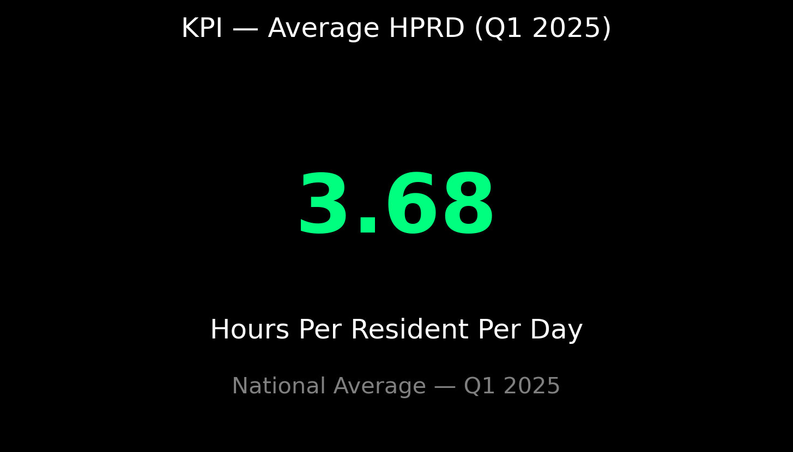

---

## Question 2  
### How are total hours distributed among Registered Nurses (RNs), Licensed Practical Nurses (LPNs), and Certified Nursing Assistants (CNAs)?

**Insight**

- The staffing mix is strongly CNA-centered across the dataset: **CNA hours account for ~63.41% of total nursing hours**, **LPNs ~23.70%**, and **RNs ~12.90%**.  
- This confirms a national model where CNAs deliver the majority of direct hands-on care while RNs perform clinical oversight, care planning, and complex clinical tasks. LPNs bridge the two roles for many facilities.

**Recommendation**

- Use role-specific metrics (e.g., RN hours per 100 residents, CNA hours per resident) when assessing quality-of-care initiatives. CNAs are the primary driver of direct care; investments in CNA training and retention will materially affect day-to-day resident experience.  
- Where RN coverage is a regulatory expectation, ensure target RN hours are part of staffing plan audits rather than relying solely on total HPRD.

**Conclusion**

- The national staffing mix is heavily weighted to CNAs, which is typical and operationally efficient, but RN staffing intensity is a crucial signal when assessing clinical capacity and care quality.

**Chart**  
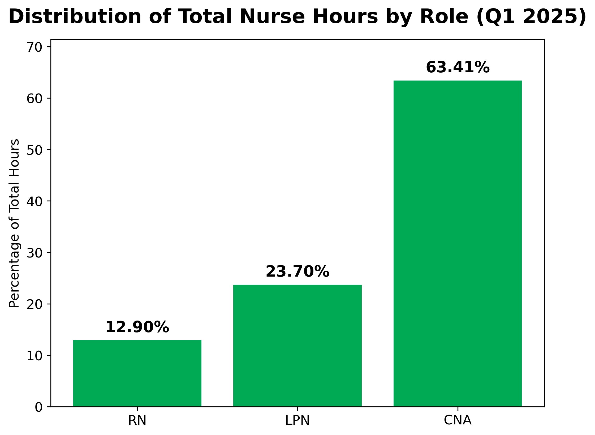

---

## Question 3  
### Which states have the highest and lowest average staffing hours per resident day?

**Insight**

- State-level variation is significant. The highest average HPRD states include **Alaska (≈6.74)**, **Puerto Rico (≈5.28)**, and **D.C. (≈4.73)**. The lowest include **Missouri (≈2.72)**, **Texas (≈3.07)**, and **Oklahoma (≈3.14)**.  
- These differences reflect a mix of factors: facility census distributions by state, regulatory and staffing norms, wage and workforce availability, and regional acuity patterns.

**Recommendation**

- When comparing facility-level performance, anchor comparisons within the same state or adjust for state-level norms. For policy or quality interventions, prioritize states with low HPRD for staffing support or deeper audits to ensure resident needs are met.

**Conclusion**

- State-level HPRD differences are large enough to require state-specific benchmarks. National averages are useful, but state comparisons better guide local policy and operational decisions.

**Chart**  
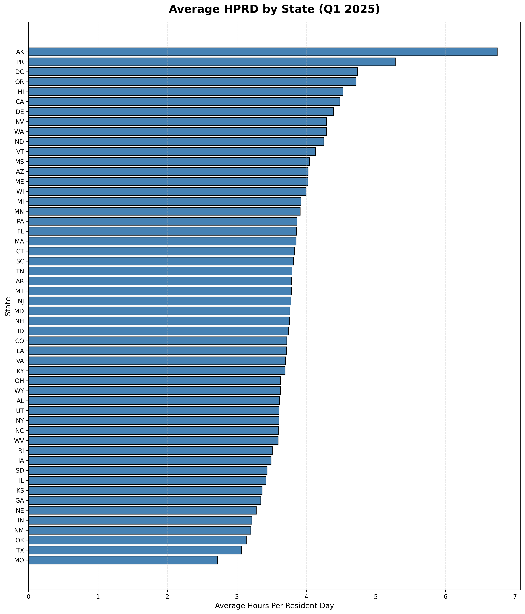

---

## Question 4  
### Which facilities report unusually high or low total staffing hours?

**Insight**

- High-hour outliers are mainly present in large census facilities — an expected outcome when total daily hours scale with facility size. These high-hour facilities can be operationally legitimate (large census) rather than erroneous.  
- Low-hour or zero-hour patterns, where present, often denote reporting issues (missing submissions, provider ID linkage gaps, or temporary closures) rather than true service absence. The outlier scatter chart highlights the high-hour population distinctly and shows where reporting gaps may exist.

**Recommendation**

- Investigate facilities flagged as outliers: confirm the census reporting and validate whether high hours align with large census or special circumstances (e.g., surge staffing, outbreak response). For low/zero-hour rows, coordinate with submitters to correct PBJ submissions and resolve provider ID linkages.

**Conclusion**

- The dataset includes both operationally valid high-hour providers and reporting-driven low-hour anomalies. Quality control processes should separate legitimate operational outliers from submission errors.

**Chart**  
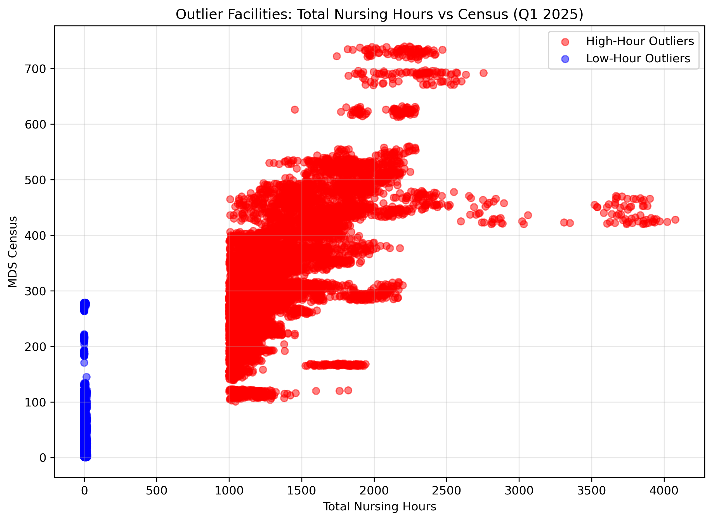

---

## Question 5  
### How do daily staffing hours change across January–March 2025?

**Insight**

- Daily total nurse hours show a **strong, repeating weekly cycle** throughout Q1: weekday peaks usually around **~4.6–4.7 million total hours**, and weekend troughs near **~3.8–3.9 million hours**. There are no significant unexpected gaps or missing days; the dataset contains the full 90-day quarter.  
- This repeating pattern indicates stable scheduling practices across facilities nationwide.

**Recommendation**

- Use the predictable weekly pattern to optimize scheduling and reduce overtime risk; consider targeted weekend coverage strategies if quality metrics show weekend underperformance.  
- Use weekly cadence as a baseline for early detection of abnormal activity (e.g., sudden drops or spikes might signal data issues or localized events).

**Conclusion**

- The weekly staffing rhythm is robust across Q1 2025. This operational stability makes time-series comparisons and forecasting feasible and reliable for short-term workforce planning.

**Chart**  
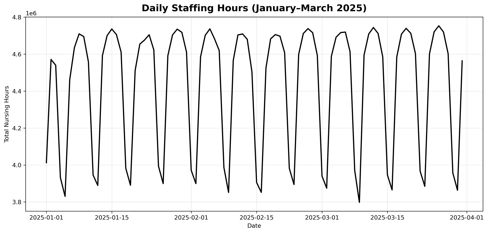

---

## Question 6  
### Does the number of residents in a facility influence how much staff time is provided per resident?

**Insight**

- Yes. Two complementary views were generated: a **Full Dataset view** that includes reporting gaps and a **Operational Range view** that excludes impossible HPRD values and missing census rows. The combined evidence shows:  
  - **Small-census facilities** (particularly under ~30–50 residents) display highly variable and often inflated HPRD because fixed RN staffing and administrative hours divide across a small denominator.  
  - **Larger facilities** stabilize within a narrower HPRD band (roughly 3.5–5.5 after removing unrealistic values).  
  - The dataset contains **782 rows with NULL census** which create artificial outliers and must be acknowledged when interpreting raw HPRD.

**Recommendation**

- Always stratify HPRD analysis by facility size. When constructing staffing benchmarks, create separate bands for small, medium, large, and very large facilities.  
- For operational decisions, treat small-facility HPRD with caution — supplement with absolute hours and role-specific coverage metrics (e.g., RN hours per shift).

**Conclusion**

- Census size is a primary driver of per-resident staffing metrics. Clear, size-stratified benchmarks produce more accurate and actionable insights than a single national HPRD benchmark.

**Charts**  
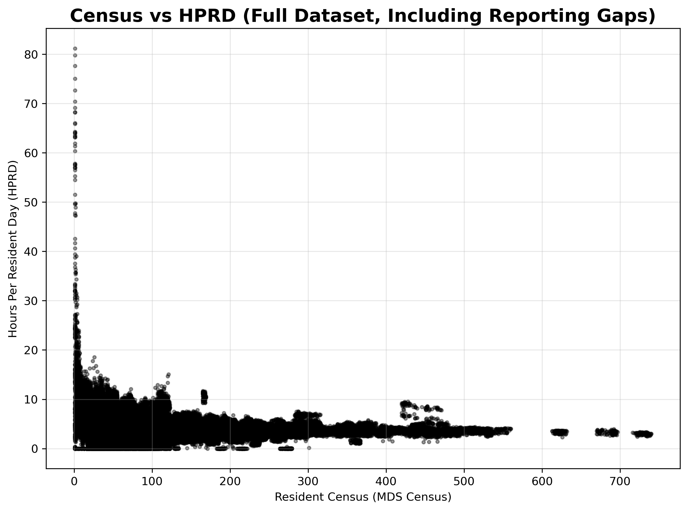  
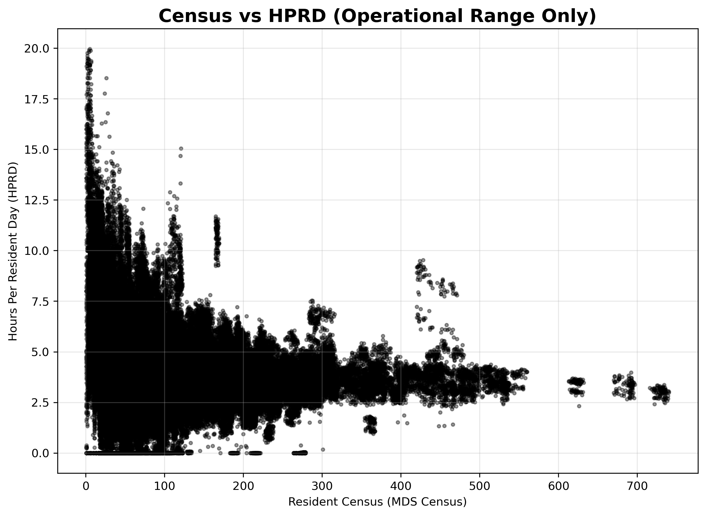

---

## Question 7  
### Do facilities provide fewer staff hours per resident on weekends compared to weekdays?

**Insight**

- The analysis shows a consistent difference: **Weekday average HPRD ≈ 3.86**, **Weekend average HPRD ≈ 3.25**, a reduction of roughly **15–16%** on weekends. This pattern is present across the nation and is consistent with common staffing models where reduced weekend schedules are used.

**Recommendation**

- Facilities should evaluate weekend staffing adequacy against resident acuity and quality indicators (falls, medication errors, response times). Where weekend quality metrics are weaker, consider adjusting minimum weekend staffing thresholds or redesigning shift overlap to maintain continuity of care.

**Conclusion**

- Reduced weekend staffing is an industry-wide pattern. It is operationally understandable but should be actively managed to avoid weekend-related quality and safety issues.

**Chart**  
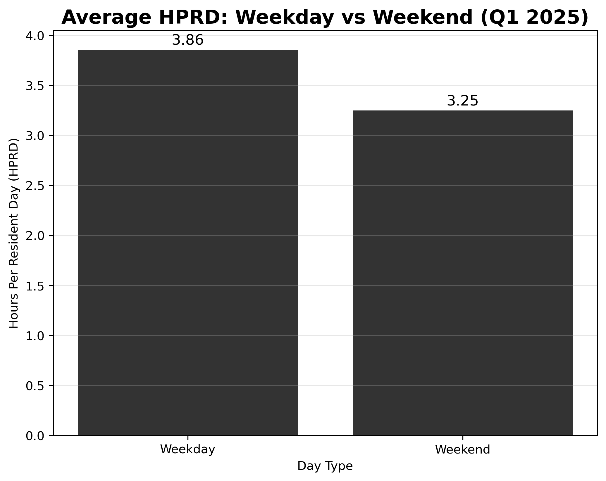

---

## Question 8  
### Do facilities that lack a valid Provider ID number differ significantly in their reported staffing or census levels?

**Insight**

- There are **two categories** in the dataset: `Valid_ID` and `Missing_ID`. Counts observed: **~1,294,830 Valid_ID rows** and **~14,760 Missing_ID rows**. Compared with Valid_ID records, Missing_ID records show:  
  - **Lower average census** (≈56 residents vs ≈85 residents), and  
  - **Higher average HPRD** (≈4.21 vs ≈3.68).  
- These differences indicate that Missing_ID rows are typically smaller units or reporting fragments (sister facilities, wings, or partial submissions) and they tend to produce more variable or inflated per-resident metrics.

**Recommendation**

- Flag Missing_ID submissions for data quality review. Where possible, reconcile and merge sister/associated submissions into the canonical provider record in CMS to improve downstream analytics. Exclude or separately label Missing_ID rows in benchmarking analyses to avoid skewing comparisons.

**Conclusion**

- Missing Provider ID submissions materially differ from canonical facility rows. They should be reviewed and treated as a distinct category rather than being mixed into ordinary facility-level comparisons.

**Chart**  
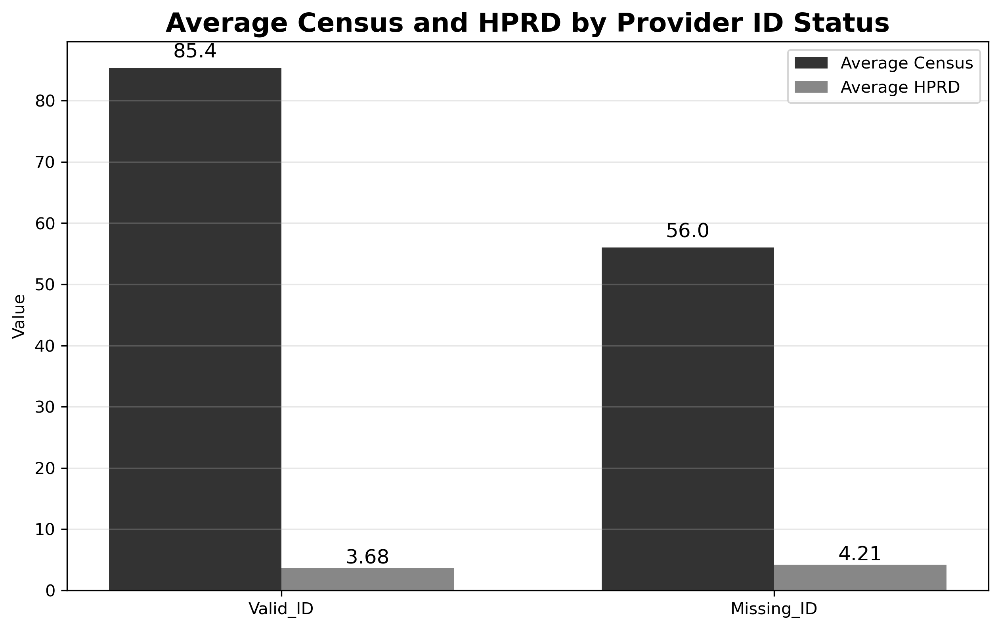

---

## Question 9  
### What is the ratio of Registered Nurse hours to Certified Nursing Assistant hours across states or facility sizes?

**Insight**

- **Method note:** Rows with **CNA = 0** were excluded from ratio calculations because the RN/CNA ratio is undefined when the denominator is zero. Those CNA=0 rows were not dropped from the dataset entirely — they are discussed explicitly in the narrative and flagged as reporting anomalies where appropriate. The dataset contained **5,136 rows with CNA = 0**; these rows are reported but excluded from RN/CNA ratio math to avoid infinite values.  
- **State-level RN/CNA ratio (descending highlights):** HI (~0.47), AK (~0.41), UT (~0.39) show the highest RN presence; LA (~0.05), AR (~0.08), OK (~0.11) show the lowest RN presence. These differences suggest meaningful variation in clinical staffing intensity across states.  
- **Facility-size RN/CNA ratio:** Small facilities (0–50 residents) have the highest ratio (~0.26), while medium and large facilities average around ~0.19–0.21. This indicates that smaller homes carry proportionally more RN hours relative to CNA hours, likely due to administrative/oversight time and the denominator effect.

**Recommendation**

- Use RN/CNA ratios as a comparative clinical staffing intensity metric while explicitly documenting exclusions (CNA=0). For states with low RN-to-CNA ratios, consider targeted RN recruitment programs or supervisory models to ensure clinical oversight. For large facilities with low ratios, evaluate whether CNA-heavy models are providing adequate supervision.

**Conclusion**

- RN-to-CNA ratios vary significantly by state and by facility size. Ratios are a useful comparative metric when computed on valid denominators and when CNA=0 anomalies are transparently documented.

**Charts**  
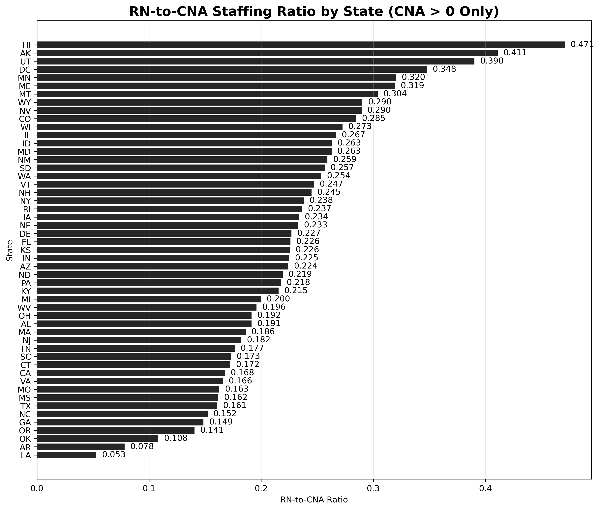  
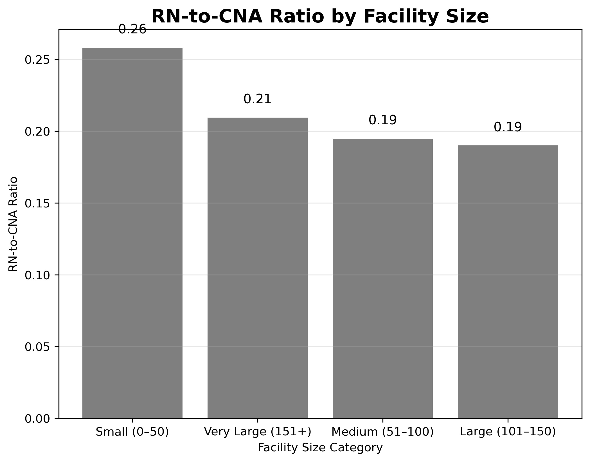

---

## Question 10  
### What major staffing, care, and operational trends can be identified from this dataset for Quarter 1 of 2025?

**Insight (Executive Summary)**

This Q1 2025 PBJ dataset reveals a consistent set of operational realities and reporting issues:

- **Stable national baseline:** Average HPRD ≈ **3.68**.  
- **CNA-dominant staffing mix:** CNAs constitute the majority of nursing hours (~63.4%).  
- **Weekly operational rhythm:** Repeating weekly peaks (weekdays) and troughs (weekends), with weekend HPRD ~15% lower.  
- **Census-driven HPRD variability:** Small facilities show inflated and more variable HPRD; larger facilities show stable HPRD bands. There are **782 rows with NULL census** that create artificial outliers and require careful handling.  
- **Reporting gaps and provider linkage:** Missing Provider ID rows (~14,760) and CNA=0 rows (~5,136) reveal submission and linkage issues that can distort analysis if not flagged.  
- **Geographic variation:** RN staffing intensity and HPRD vary considerably by state, suggesting policy, workforce, and market differences.  
- **Outliers:** High-hour outliers are typically operational (large facilities); low-hour anomalies are often reporting-related.

**Recommendation (Executive)**

- Strengthen data quality controls for PBJ submissions (particularly census and provider linkage). Flag and reconcile missing Provider IDs and CNA=0 rows before using HPRD or RN/CNA metrics in formal benchmarking.  
- Adopt size-stratified benchmarks for HPRD and implement minimum weekend-staffing checks to mitigate the ~15% weekend drop.  
- Use RN/CNA ratios alongside other clinical measures to prioritize workforce support and regulatory review in states or facilities with extreme ratios.

**Conclusion (Executive)**

- Q1 2025 PBJ data provides a reliable portrait of national staffing rhythms, a clear view of role-based staffing (CNA-heavy), and important signals about reporting quality. When approached with appropriate filters, size stratification, and transparency about excluded rows, the dataset supports credible benchmarking, policy review, and operational improvement initiatives across long-term care.

---

# Tableau Dashboards (static screenshots)
These dashboards provide interactive views of the trends summarized above and are included as static PNG snapshots below.

 
 

---

## Appendix — Notes on methodology & data quality
- All charts used in this report were generated from the processed PBJ dataset and saved as PNG images. The README presents final interpretation only (no working code blocks).  
- Key exclusions & notes: rows with **CNA = 0** were excluded from RN/CNA ratio computations (because they produce undefined ratios). Rows with **NULL census** (n ≈ 782) are flagged and discussed in the relevant sections. Outlier detection logic was applied conservatively; extreme HPRD (>20) was treated as a reporting anomaly for some operational views but retained in the raw/full views to preserve transparency.  
- Where appropriate, charts include interactive Tableau alternatives (see dashboard PNGs) for deeper drill-down.

---

## Author & License
**Sharon Mwandoe - Lead Data Analyst**
**Veritas Data Services** — PBJ Nurse Staffing Analysis (Q1 2025)  
**© 2025 Veritas Data Services — All Rights Reserved**

