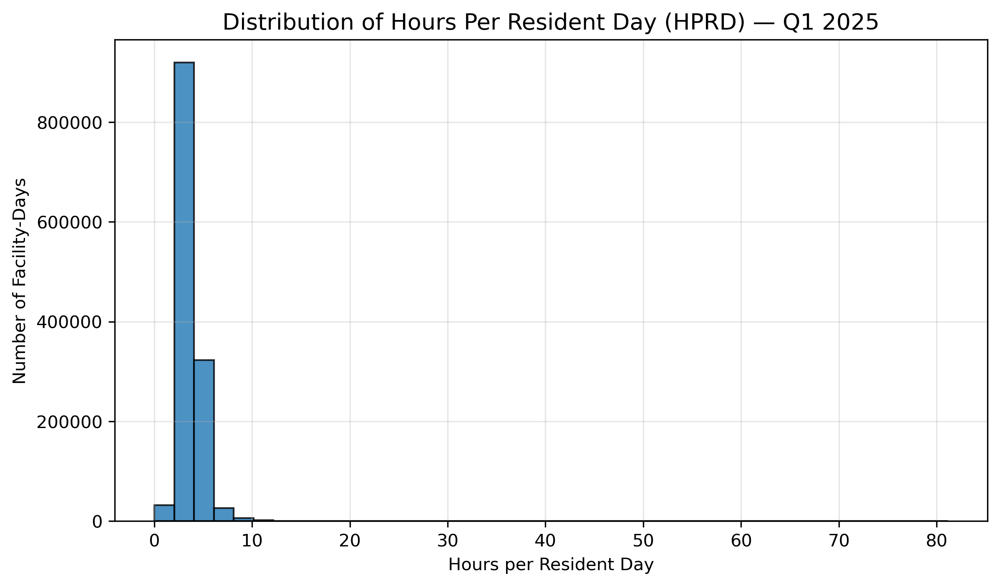
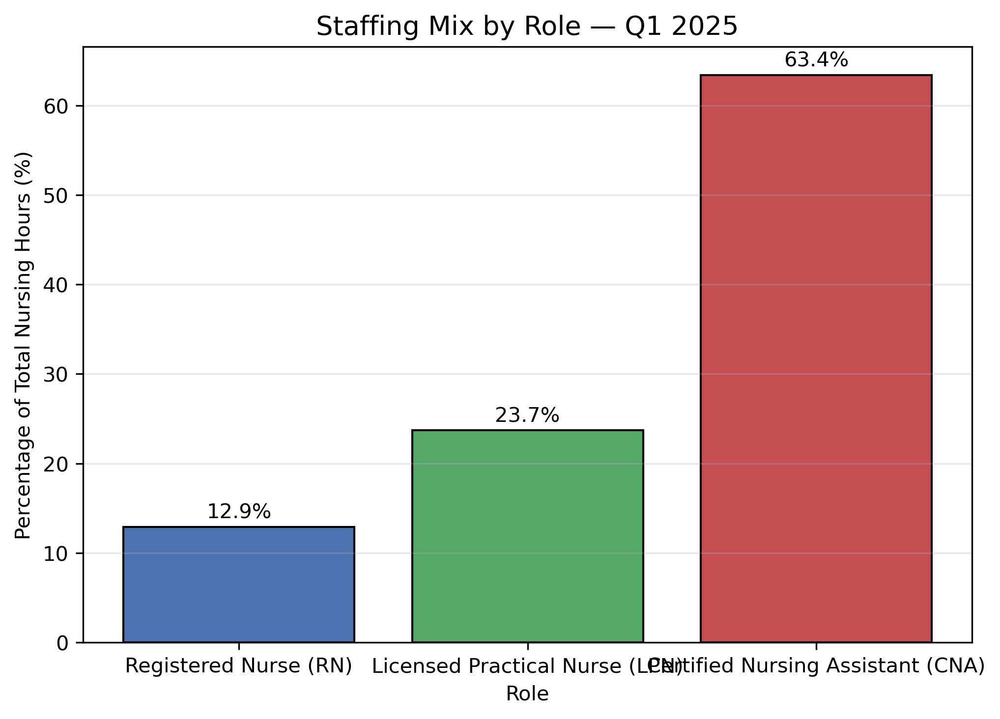
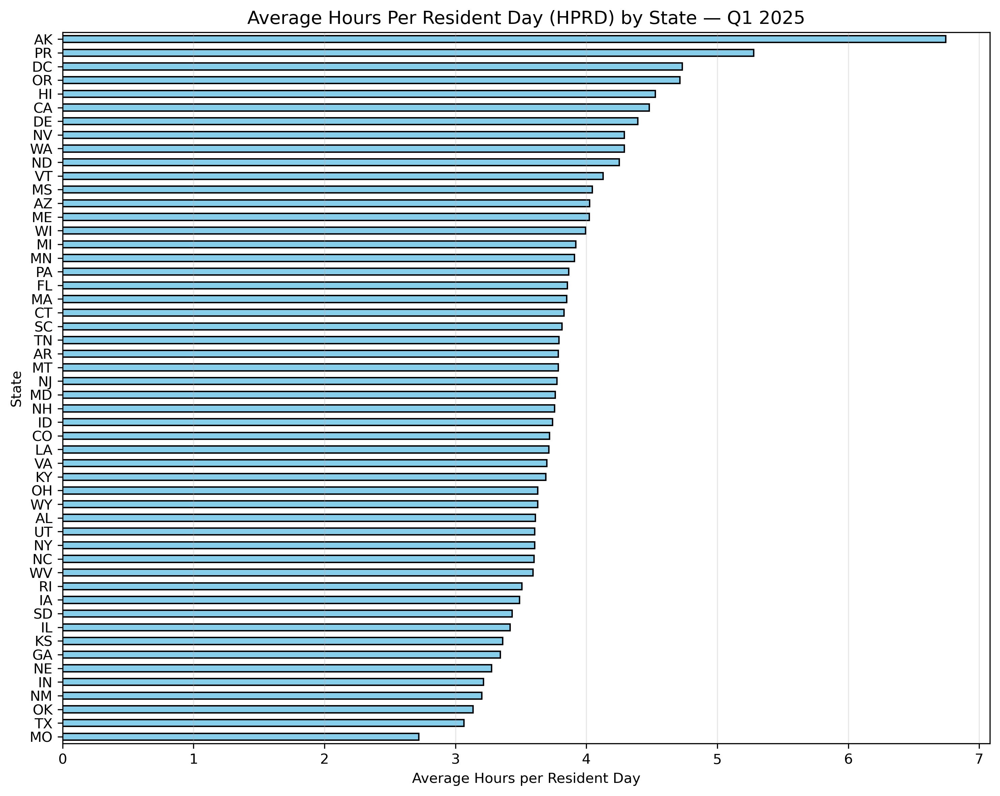
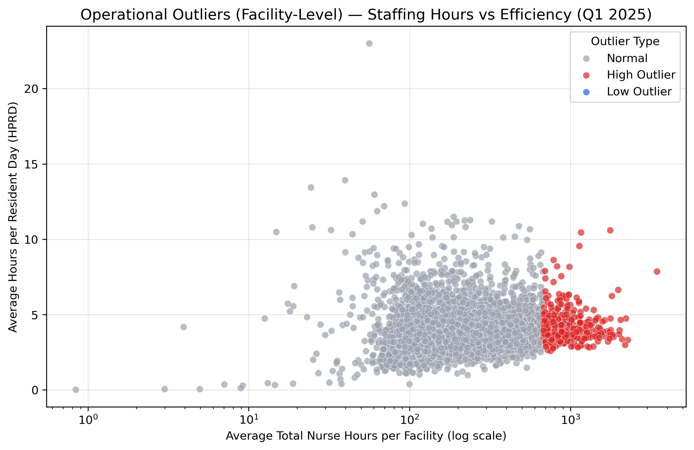
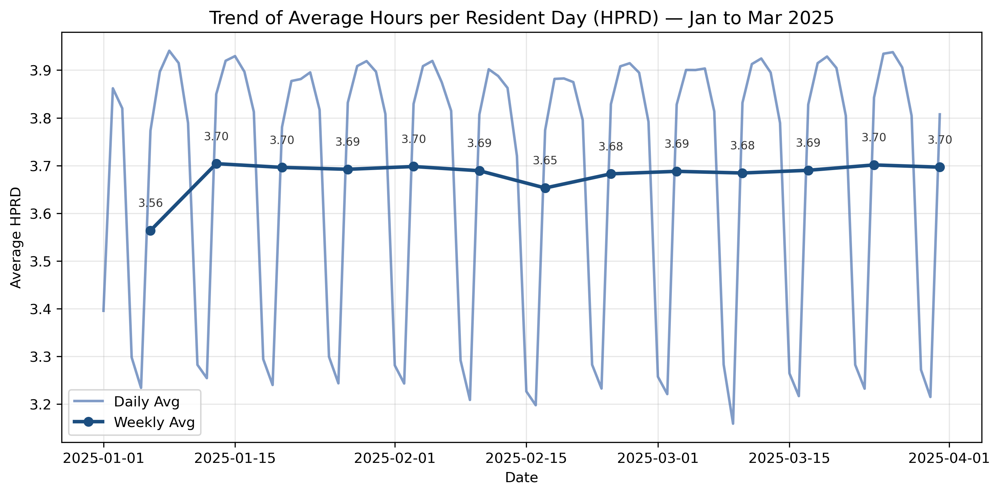
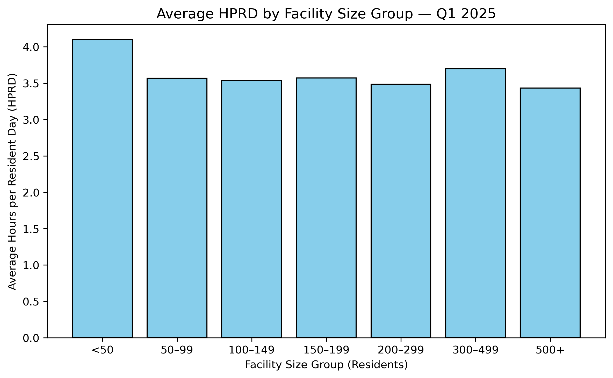
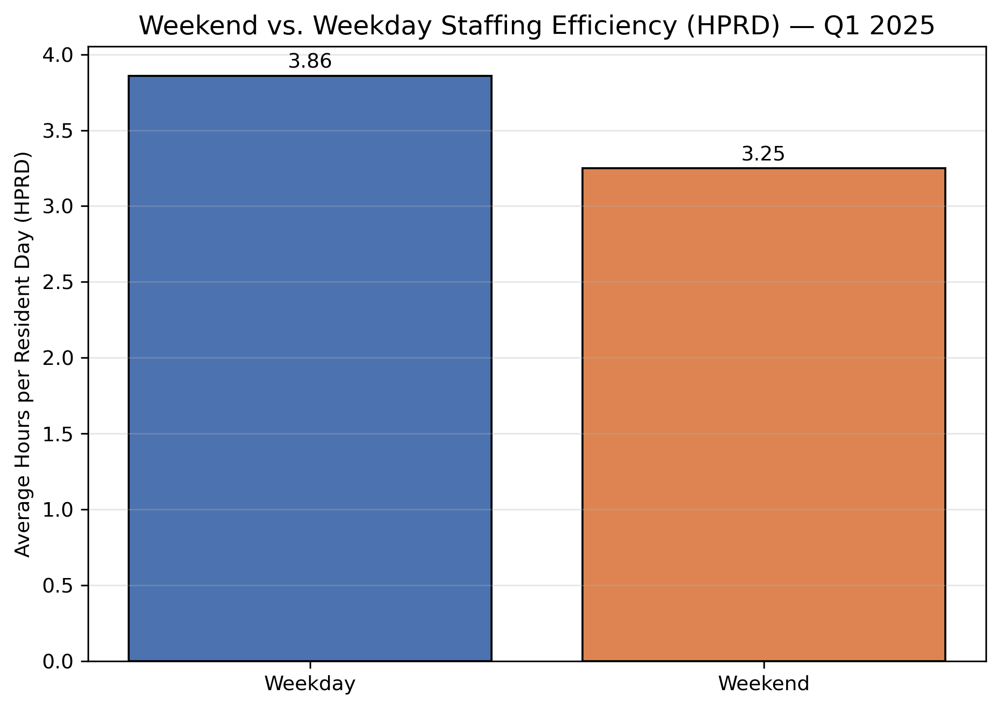
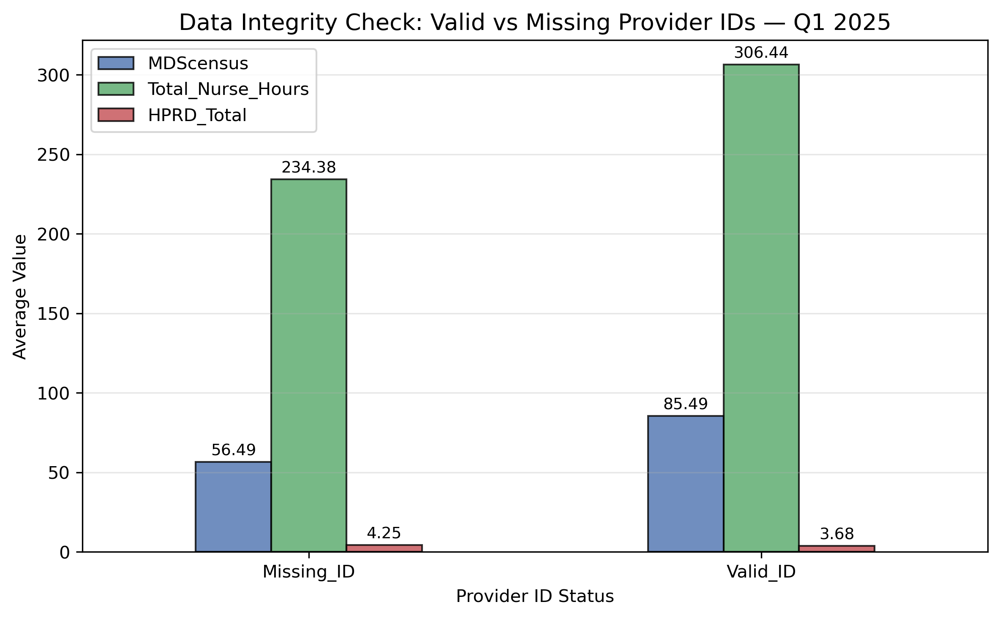
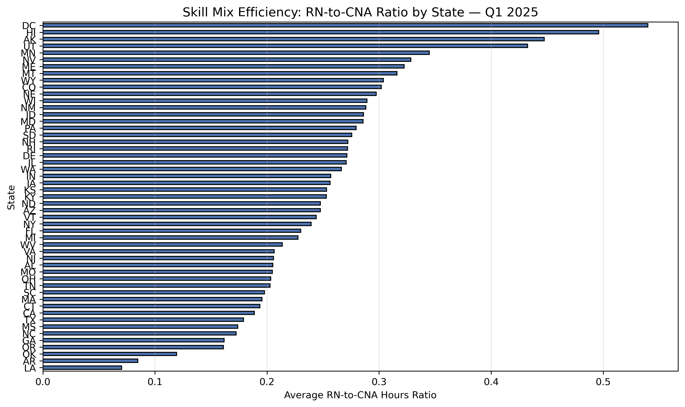
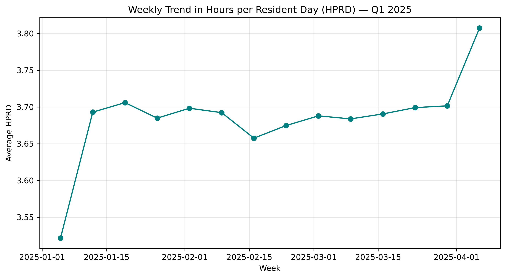

# PBJ Nurse Staffing Analysis — Q1 2025  

## 🏢 Developed by Veritas Data Services  
Transforming Data into Clarity, Strategy, and Measurable Growth.  

---

## 📁 Dataset Information  
This project uses the **CMS Payroll-Based Journal (PBJ)** dataset for **Quarter 1 of 2025**, covering over **1.3 million daily staffing records** across U.S. nursing facilities.  

Due to GitHub’s upload limits, a reduced sample dataset (`pbj_sample.csv`) is stored in one of the files.  
This version maintains the same schema and representative distribution as the full dataset, ensuring reproducibility for learning and analysis.  

---

## 🎯 Project Objective  
The goal of this analysis is to uncover patterns in **nursing facility staffing efficiency, role mix, operational consistency, and data integrity** across more than 14,000 U.S. facilities.  
We focused on the core performance metric — **Hours Per Resident Day (HPRD)** — to understand how staffing hours vary by state, facility size, and time.  

---

## 🧠 Tools & Technologies  
| Tool | Purpose |
|------|----------|
| **Python (Pandas, Matplotlib, Seaborn)** | Data analysis & visualization |
| **Excel / CSV Processing** | Data cleaning & verification |
| **Tableau (Upcoming)** | Interactive dashboard development |
| **GitHub** | Version control & portfolio hosting |

---

## 📊 Key Analysis Questions  
| # | Question | Insight Purpose |
|---|-----------|-----------------|
| 1️⃣ | What is the national average HPRD? | Establish baseline staffing levels |
| 2️⃣ | What is the staffing mix by role (RN, LPN, CNA)? | Understand labor distribution |
| 3️⃣ | Which states have the highest and lowest HPRD? | Identify geographic disparities |
| 4️⃣ | Which facilities are outliers in staffing? | Detect overstaffed/understaffed sites |
| 5️⃣ | How do staffing hours change across Q1? | Reveal weekly/monthly trends |
| 6️⃣ | Does facility size impact staffing efficiency? | Compare scalability effects |
| 7️⃣ | Do weekends show fewer staff hours? | Measure weekend coverage gaps |
| 8️⃣ | How does data integrity differ by Provider ID presence? | Detect reporting inconsistencies |
| 9️⃣ | What is the RN-to-CNA ratio by state? | Explore skill mix variations |
| 🔟 | What are the key overall staffing patterns? | Executive summary for decision-makers |

---

## 📈 Visual Insights  

### 1️⃣ Distribution of HPRD  
  

### 2️⃣ Staffing Mix by Role  
  

### 3️⃣ Average HPRD by State  
  

### 4️⃣ Facility Operational Outliers  
  

### 5️⃣ Daily Trends Over Quarter  
  

### 6️⃣ Facility Size vs Efficiency  
  

### 7️⃣ Weekend vs Weekday Patterns  
  

### 8️⃣ Data Integrity (Provider ID Comparison)  
  

### 9️⃣ RN-to-CNA Ratio by State  
  

### 🔟 Q1 2025 Key Metrics Summary  
  

---

## 📘 Insights Overview  
- **Average Staffing:** 3.68 HPRD nationally, with median 3.55.  
- **Staffing Mix:** CNAs deliver 63% of total care hours.  
- **State Variation:** Alaska leads at 6.74 HPRD; Missouri ranks lowest at 2.72.  
- **Outliers:** 4% of facilities show high staffing hours, <1% show low.  
- **Weekends:** Average staffing dips to 3.25 HPRD from weekday average of 3.86.  
- **Data Integrity:** Facilities missing Provider IDs show weaker consistency.  

---

## 💡 Key Takeaways  
- Nursing efficiency remains stable but regionally uneven.  
- Smaller facilities tend to deliver more personalized care hours.  
- Weekend coverage remains an area for operational improvement.  
- Consistent data reporting (Provider IDs) is critical for policy accuracy.  

---

## 🚀 Next Phase — Tableau Dashboard  
A fully interactive **Tableau dashboard** will be developed in the next phase, providing state-level drilldowns, facility-level insights, and dynamic filters for better operational monitoring.  
*(Link will be added once published.)*  

---

## 🏁 Author & Credit  
This analysis was conducted by **Veritas Data Services**, an independent data consultancy specializing in analytics, visualization, and operational reporting.  

📧 Contact: **info@veritasdataservices.com**  
🌐 Portfolio: *(coming soon)*  

---

© 2025 Veritas Data Services — All Rights Reserved.

